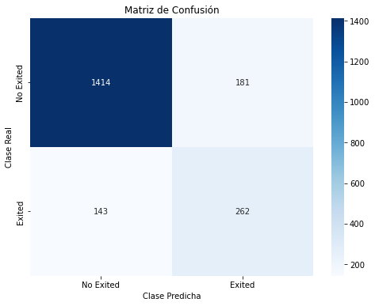
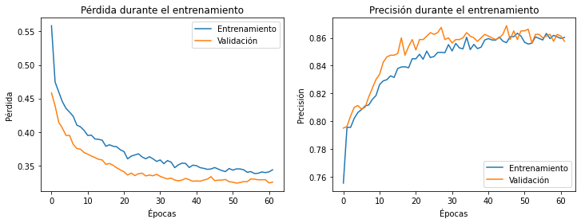

# Predicción de Fuga de Clientes en un Banco usando Redes Neuronales

## Índice

- [Introducción](#introducción)
- [Dataset](#dataset)
- [Instalación y Configuración](#instalación-y-configuración)
- [Exploración y Preprocesamiento de Datos](#exploración-y-preprocesamiento-de-datos)
- [Construcción del Modelo](#construcción-del-modelo)
- [Entrenamiento del Modelo](#entrenamiento-del-modelo)
- [Resultados](#resultados)
- [Licencia](#licencia)

---

## Introducción

La retención de clientes es un aspecto crucial para el éxito de cualquier institución financiera. Comprender los factores que llevan a un cliente a abandonar el banco permite implementar estrategias de retención efectivas. Este proyecto utiliza técnicas de aprendizaje automático, específicamente redes neuronales, para predecir si un cliente abandonará el banco.

El objetivo principal es desarrollar un modelo de red neuronal que pueda predecir con precisión si un cliente abandonará el banco basándose en diversos atributos demográficos y financieros.

## Dataset

El dataset utilizado es **"Churn_Modelling.csv"**, que contiene información sobre 10,000 clientes de un banco, incluyendo características como:
Puntuación de crédito del cliente, País de residencia, Género del cliente, Edad del cliente, Número de años que el cliente ha sido cliente del banco, Balance de la cuenta bancaria, Número de productos bancarios utilizados, Si el cliente tiene una tarjeta de crédito, Si el cliente es un miembro activo, Salario estimado del cliente, Variable objetivo, indica si el cliente ha abandonado el banco (1) o no (0).

## Instalación y Configuración

## Requisitos

- - **Python 3.8+, spyther**


## Instalación

1. **Clonar el Repositorio**
   ```bash
   git clone https://github.com/moises60/red-neuronal-artificial-python.git
   ```
---

## Exploración y Preprocesamiento de Datos

### Carga de Datos
- **Dimensiones del dataset:** 10,000 filas y 14 columnas.

### Preprocesamiento de Datos

1. **Eliminación de Columnas Irrelevantes**

   Las columnas `RowNumber`, `CustomerId` y `Surname` se eliminaron ya que no aportan información relevante para la predicción.

   ```python
   dataset = dataset.drop(['RowNumber', 'CustomerId', 'Surname'], axis=1)
   ```

2. **Codificación de Variables Categóricas**

   Se utilizaron **variables dummy** para convertir las variables categóricas `Geography` y `Gender` en variables numéricas.

   ```python
   dataset = pd.get_dummies(dataset, columns=['Geography', 'Gender'], drop_first=True)
   ```

3. **Separación de Características y Variable Objetivo**

   ```python
   X = dataset.drop('Exited', axis=1)
   y = dataset['Exited']
   ```

4. **Escalado de Características**

   Se aplicó **StandardScaler** a las características numéricas para normalizar los datos.

   ```python
   from sklearn.preprocessing import StandardScaler

   scaler = StandardScaler()
   numeric_features = ['CreditScore', 'Age', 'Tenure', 'Balance', 'NumOfProducts', 'EstimatedSalary']

   X_train[numeric_features] = scaler.fit_transform(X_train[numeric_features])
   X_test[numeric_features] = scaler.transform(X_test[numeric_features])
   ```
- **Por curiosidad, probé crear el modelo sin realizar el escalado de los datos, y la eficiencia bajaba considerablemente, alcanzando apenas el 61%. Además, la matriz de confusión era un completo desastre, lo que resalta la importancia del preprocesamiento de datos**
## Construcción del Modelo

Se utilizó una **Red Neuronal Artificial** con la siguiente arquitectura:

- **Capa de Entrada:** Número de neuronas igual al número de características de entrada.
- **Capas Ocultas:**
  - Primera capa oculta con 64 neuronas y activación ReLU.
  - Segunda capa oculta con 32 neuronas y activación ReLU.
  - Tercera capa oculta con 16 neuronas y activación ReLU.
  - Se aplicó **Dropout** para prevenir el sobreajuste.
- **Capa de Salida:** Una neurona con activación sigmoide para la predicción binaria.


## Entrenamiento del Modelo

Se entrenó el modelo durante 100 épocas con un tamaño de batch de 32. Se implementó **EarlyStopping** para detener el entrenamiento si la pérdida en el conjunto de validación no mejoraba después de 10 épocas.

## Evaluación del Modelo

### Predicción y Umbral de Clasificación

Se ajustó el umbral de clasificación a 0.35 para mejorar el balance entre precisión y recall. es decir si hay un 35 porciento de posibilidades de que salga, se considera que sale. esto se hace para mejorar la matriz de confusion pero se puede cambiar. 

## Resultados

**Matriz de Confusión:**

```
[[1414  181]
 [ 143  262]]
```
|                    | **Predicho: No Exited (0)** | **Predicho: Exited (1)** |
|--------------------|-----------------------------|--------------------------|
| **Real: No Exited (0)** | Verdaderos Negativos (VN) = 1414       | Falsos Positivos (FP) = 181          |
| **Real: Exited (1)**    | Falsos Negativos (FN) = 143        | Verdaderos Positivos (VP) = 262      |



**Informe de Clasificación:**

```
              precision    recall  f1-score   support

           0       0.90      0.91      0.91      1595
           1       0.64      0.60      0.62       405

    accuracy                           0.85      2000
   macro avg       0.77      0.75      0.76      2000
weighted avg       0.85      0.85      0.85      2000
```

### Análisis de Resultados

- **Precisión General:** 85%
- **Recall para Clase 'Exited':** Aumentó al 60%, mejorando la capacidad del modelo para identificar clientes que abandonan.
- **Aumento en Falsos Positivos:** Al ajustar el umbral, aumentaron los falsos positivos, lo que implica más clientes predichos incorrectamente como abandonos.

1. **Verdaderos Negativos (VN) - 1414:**
   - Clientes que no abandonaron y fueron correctamente predichos como "No Exited".
   
2. **Falsos Positivos (FP) - 181:**
   - Clientes que no abandonaron pero fueron predichos incorrectamente como "Exited".
   
3. **Falsos Negativos (FN) - 143:**
   - Clientes que sí abandonaron pero fueron predichos incorrectamente como "No Exited".
   
4. **Verdaderos Positivos (VP) - 262:**
   - Clientes que sí abandonaron y fueron correctamente predichos como "Exited".


## Licencia
el dataset y parte código se Extrajeron del siguiente repositorio : https://github.com/joanby/machinelearning-az/tree/master/original/Part%208%20-%20Deep%20Learning/Section%2039%20-%20Artificial%20Neural%20Networks%20(ANN) 


